# py-tbparse

[](https://pypi.org/project/py-tbparse/)
[](https://pypi.org/project/py-tbparse/)
[](https://github.com/DDSNA/py-tbparse/actions/workflows/ci.yml)
[](https://github.com/DDSNA/py-tbparse/blob/main/LICENSE)

py-tbparse reads Tableau workbooks (`.twb` and `.twbx`) without Tableau. It shows what is inside a workbook, checks it for problems, and makes new copies of it: with cleaner field names, without private details, with only some dashboards, with sheets or calculations from another workbook, or filled with new data from a template. Your original file is never changed.

You can use it in a page in your web browser (no programming; see the [user's guide](#users-guide)), from the command line, or from Python. Tableau and R are not needed. It began as a port of PrigasG's R package [twbparser](https://github.com/PrigasG/twbparser).


## Contents

- [User's guide](#users-guide): the app in your web browser, for people who work with Tableau but do not program
  - [Get started](#get-started): install, start the app, open a workbook, find your way around
  - [The screens](#the-screens): Overview, the tables, Dashboards, the graph, Field renames, Audit, Libraries, Styles, Slice and copy, Templates, Theme
  - [Good to know](#good-to-know): your files and privacy, what has not been checked in Tableau, when something goes wrong, words used here
- [For developers and power users](#for-developers-and-power-users): Python, the command line, all the guides, development
- [Limits](#limits)
- [Contributing](#contributing), [Credit](#credit), [License](#license)

## User's guide

This guide is about the app that runs in your web browser. You click; you do not type code. Your workbook is never changed: everything you make is a new file that your browser downloads.

Click a line with a small triangle to open it. Each part stands on its own, so jump to the screen you need.

**The example.** Every picture uses one public workbook, `Brushing_Superstore_Sales_Map.twb` from [github.com/1230harry/TeamOne_MSc_Group_Project](https://github.com/1230harry/TeamOne_MSc_Group_Project) (MIT licence), built on Tableau's "Sample - Superstore" data, saved here as `superstore-sales-map.twb`. It has one dashboard, four worksheets, three tables (Orders, People and Returns), seven calculated fields and four parameters. The pictures were taken with version 0.5.4.

### Get started

<details>
<summary><b>Install it</b> (once, about five minutes)</summary>

1. Install **Python** (3.9 or newer) from [python.org/downloads](https://www.python.org/downloads/). On Windows, tick **Add python.exe to PATH** on the first screen of the installer.
2. Open a terminal: on Windows press Start, type `cmd` and open **Command Prompt**; on a Mac open **Terminal** (Applications, Utilities).
3. Copy this line into it and press Enter:

   ```bash
   python -m pip install "py-tbparse[excel]"
   ```

   On Windows, if `python` is not found, type `py` in its place; on a Mac, `python3`. Run the same line again later to update.

There is no account to create, and nothing is sent anywhere.

</details>

<details>
<summary><b>Start the app and open a workbook</b></summary>

1. In the terminal, type this and press Enter:

   ```bash
   py-tbparse-gui
   ```

   Your web browser opens a new tab with the app. Leave the terminal window open while you work; closing it stops the app.
2. Open a workbook (`.twb` or `.twbx`) in one of three ways:
   - drag the file from your folder onto the page;
   - press **Open file...** and pick it;
   - paste the file's full path into the long box at the top and press **Load** (remove the quotation marks Windows adds with **Copy as path**).

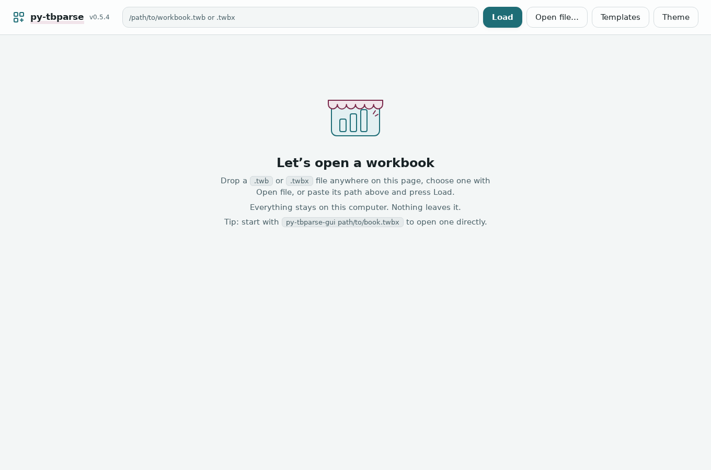

**Dropped, or opened by path?** It matters in one place. Open a workbook by its path and the Field renames screen can save the renamed copy in the same folder as the original. Drop or pick a file and the app works on a private temporary copy, so it offers a download instead. Every other screen always gives you a download, which goes to your browser's usual downloads folder.

The start screen also lists the workbooks you opened by path recently, so you can open them again with one click.

</details>

<details>
<summary><b>Find your way around</b></summary>

- **The top bar** has the path box, **Load**, **Open file...**, **Templates** (make or fill a template, see below) and **Theme** (colours and dark mode).
- **The list on the left** has every screen. The **Workbook** group holds the tools: Overview, Audit, Libraries, Styles, Slice and copy. The **Data**, **Data model**, **Dashboards** and **SQL** groups hold tables you can read and save. The number beside a name is how many rows that table has.
- **Every table works the same way.** Click a column name to sort. Type in **Filter rows** to narrow the rows. Click a row to open a panel on the right with every detail of it, in full; **Close** shuts it. The `...` beside a column name sorts, filters, pins, hides or widens that column. **Columns** brings back hidden columns, **Compact rows** fits more rows on the screen, and **Export CSV** saves the table as a file Excel opens.

![The Calculated fields table with the row Profit Ratio clicked: the panel on the right shows its name, type, formula SUM([Profit])/SUM([Sales]) and datasource](docs/guide-tables.png)

</details>

### The screens

<details>
<summary><b>Overview</b>: what is in the workbook, at a glance</summary>

The first screen after you open a workbook. One sentence about it, a tile for each count, a **Worth a look** list and what is on each dashboard.

- Click a tile to open its table.
- Each line in **Worth a look** has a **Show** button that opens the table with exactly those rows, for example the calculations no worksheet uses.

For the example: "superstore-sales-map.twb has 1 dashboard, 4 worksheets and 3 datasources", tiles for 4 parameters, 2 relationships and 7 calculated fields, and two lines worth a look: 4 calculations and 20 fields that no worksheet uses.

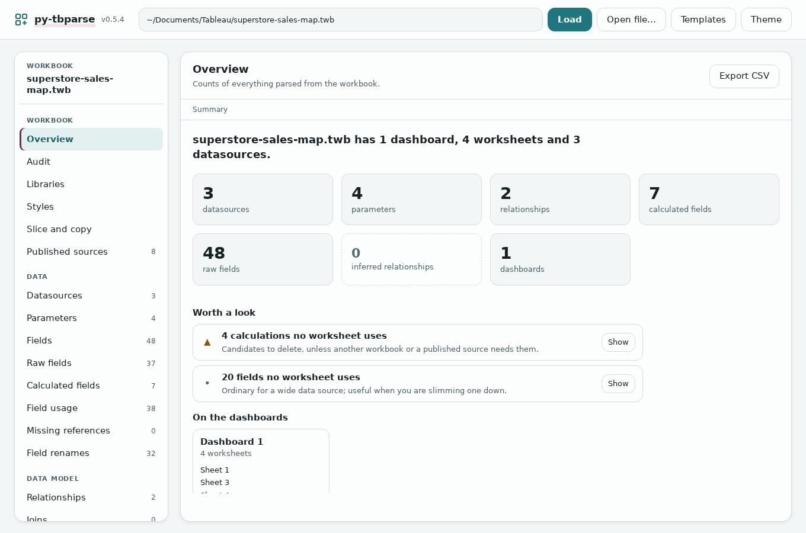

</details>

<details>
<summary><b>The tables</b>: fields, calculations, parameters, datasources and more</summary>

Click a name in the list on the left. The ones most people use:

- **Calculated fields**: every calculation with its formula (the picture in [Find your way around](#get-started)).
- **Fields**: every column of every datasource, with its type.
- **Field usage**: which worksheets, dashboards and calculations use each field. Handy before you delete or rename one.
- **Missing references**: calculations that name a field the workbook does not have. In Tableau these show as broken.
- **Parameters**, **Datasources**, **Relationships**, **Dashboard sheets**, **Custom SQL**.

The app shows what the workbook *describes*, not your data itself, and it does not draw your charts.

</details>

<details>
<summary><b>Dashboards</b>: what each dashboard holds</summary>

One row per dashboard: how many worksheets it shows and which, its size, and how many filters, parameter controls and actions it has. For the example, Dashboard 1 shows Sheet 1 to Sheet 4, has an automatic size and 2 filters.

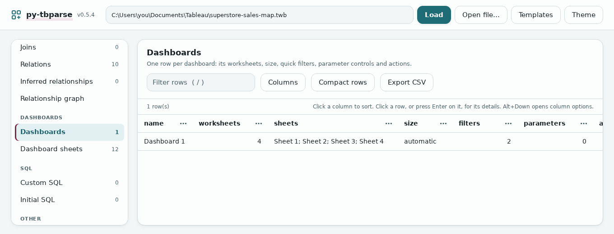

</details>

<details>
<summary><b>Relationship graph</b>: how the tables connect</summary>

Open **Relationship graph** (in the Data model group). The tables are boxes and the connections are lines, labelled with the fields they match on.

- Drag to move the picture; scroll, or press **+** and **-**, to zoom; **Fit** brings it all back on screen.
- Point at a table to highlight its connections. Click a line to see its fields.
- **View as list** shows the same connections as a table. **Save as SVG** saves the picture.

For the example: Orders connects to People on Region and to Returns on Order ID.

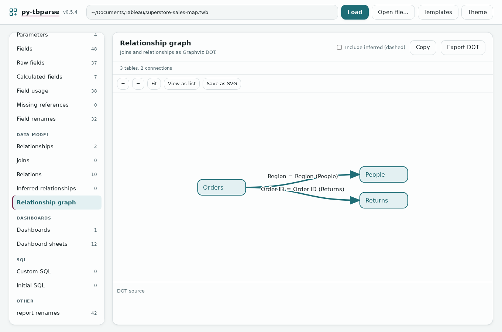

</details>

<details>
<summary><b>Field renames</b>: tidy field names in a new copy</summary>

It suggests tidy names (`SalesLOD` becomes `Sales LOD`) and makes a copy of the workbook with them. Only the name people see in Tableau changes, so sheets and formulas keep working.

1. Click **Field renames** (in the Data group).
2. Pick a style (**Title Case** to start with), a datasource or **(all datasources)**, and **Fields only** or everything (sheets, dashboards and the rest too).
3. Optional: in **Reference workbook path**, type the path of an older workbook. Fields that match take that workbook's spelling. This helps after you moved a workbook to a new datasource.
4. Untick any rename you do not want. **Select all** and **Select none** act on the whole list.
5. Press **Create with 3 of 3 renames** (the numbers follow your ticks) to save `superstore-sales-map_renamed.twb` beside the original, or **Download fixed workbook** to download it. Create only appears when you opened the workbook by its path. If the renamed file is already there, the app says so and does not replace it.

For the example there are three suggestions: `Sub-Category` to `Sub Category`, `SalesLOD` to `Sales LOD` and `SalesLOD%` to `Sales LOD%`.

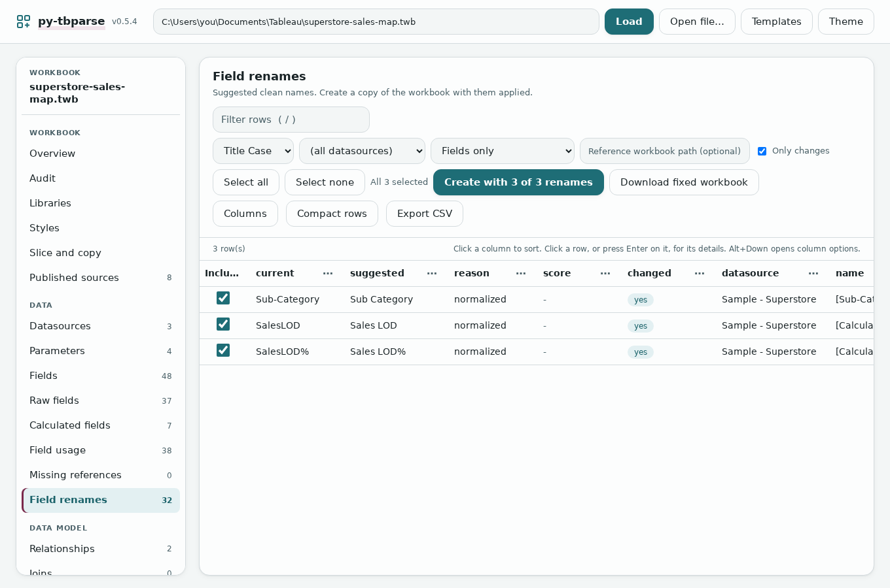

You cannot type your own names on this screen; a suggestion is either taken or left. The app does not reconnect a datasource for you, and a sheet that already points at a missing field stays broken.

</details>

<details>
<summary><b>Audit</b>: things the author probably did not mean</summary>

Click **Audit**. It lists calculations nobody uses, two calculations with the same formula, formulas that name a field that does not exist, calculations that refer to each other in a circle, unused parameters, worksheets on no dashboard, custom SQL, and data files that only exist on one computer.

- The bold line at the top counts the findings by how serious they are: Error, Warning or Info. Info means "worth knowing", not "broken".
- Each finding has a rule (A001 to A011), a message, a suggested fix in grey, and the thing it is about.
- Narrow the list with **All severities**, **All rules** or the search box.
- **Skip rules** opens the list of rules; tick one to leave it out. For example A008 (a data file on one computer) shows up in most workbooks made on a desktop.
- **Download CSV** and **Download JSON** save every finding. **Data dictionary (Markdown)** downloads a written description of the whole workbook: every datasource, field, formula, parameter, worksheet and dashboard. It prints formulas exactly as they are, so read it before you share it.

For the example: "5 info". Three calculations no worksheet uses (Category LOD, Profit (bin) and Profit Ratio) and two parameters that only those use. (The Overview counted 4 unused calculations; it also counts one with no formula, a group, that the audit leaves out.)

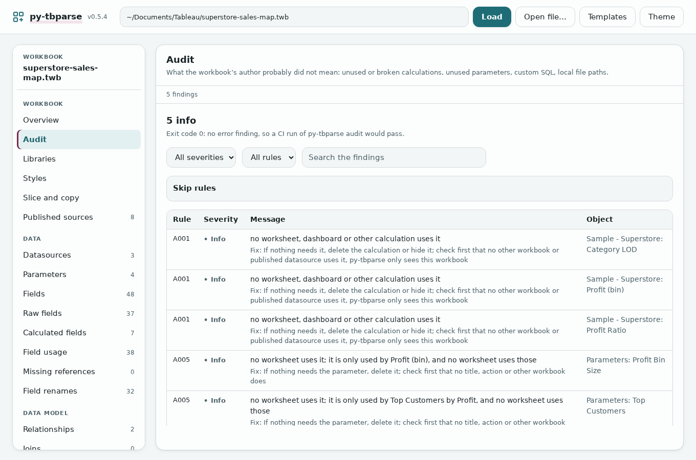

"Unused" means unused in this workbook. Another workbook or a published data source may still need the field. The audit changes nothing.

</details>

<details>
<summary><b>Libraries</b>: reuse calculated fields in another workbook</summary>

Save calculated fields and parameters from one workbook in a small *library* file, then add them to another workbook, so you do not type your KPIs again.

**Save them from this workbook**

1. Click **Libraries**. **Export from this workbook** lists the calculations and parameters with their formulas.
2. Tick the ones you want. Leave **Also take the calculations and parameters the selection uses** ticked so nothing they need is left behind.
3. Optional: give the library a name. Press **Export library file**. Your browser downloads a `.library.json` file.

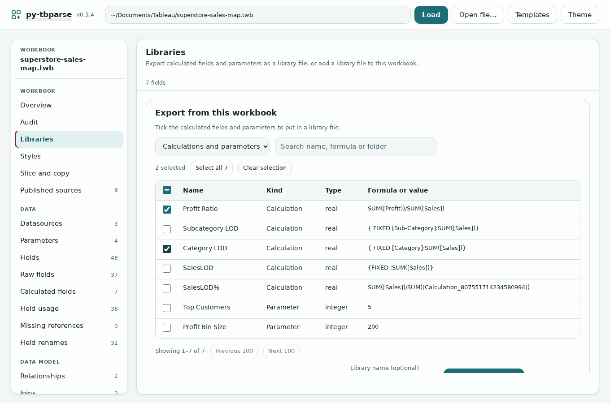

**Add them to another workbook**

1. Open the other workbook and click **Libraries**. In **Add a library to this workbook**, press **Choose a library file** and pick the `.library.json`.
2. Choose what happens when a field with the same name is already there: **Stop** (nothing is made, and the clashes are listed), **Rename** (the new one gets "(2)") or **Skip** (keep the one that is there).
3. Read the plan: one line per field with what will happen and why.
4. Press **Download new workbook**. You get `<workbook>_library.twb`.

The other workbook needs fields with the same names as the ones the formulas use (`Sales`, `Profit`...). The app does not move sets, groups or bins, and does not replace a field that is already there.

</details>

<details>
<summary><b>Styles</b>: reuse colour palettes</summary>

Copy your team's named colour palettes into a workbook, so they are in Tableau's colour picker. **This recolours nothing**: every chart keeps its colours until someone picks the palette in Tableau.

- **Palettes in this workbook** lists its own palettes with small colour chips. Tick some and press **Export style file** (a `.style.json`) or **Export as Preferences.tps** (the file Tableau Desktop keeps your palettes in).
- **Add palettes from a file**: press **Choose a palette file** and pick a `.style.json` or a `Preferences.tps`. Choose what happens when a palette with the same name but other colours is already there (**Stop**, **Skip**, **Rename** or **Replace**), read the plan, then press **Download new workbook** (`<workbook>_palettes.twb`).

The example workbook has no palettes of its own. Here a small file with two palettes was added, and the plan says **2 to add**:

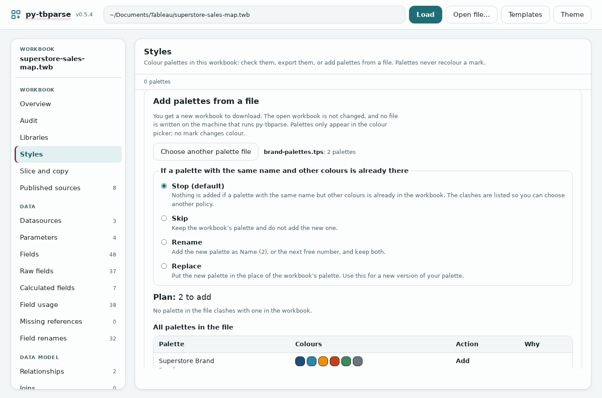

To use an exported `Preferences.tps` in Tableau Desktop, keep a copy of your own `Preferences.tps` (in My Tableau Repository), put the new one in its place and restart Tableau.

</details>

<details>
<summary><b>Slice and copy, part 1</b>: keep only some dashboards</summary>

Make a smaller copy of the workbook with only the dashboards you pick. The other dashboards go, and so do the worksheets only they used.

1. Click **Slice and copy**. In **Slice: keep some dashboards**, tick the dashboards to keep.
2. Read the **Plan**: what is kept and removed, and actions that cannot stay.
3. **Remove unused calculations, parameters and datasources afterwards** is ticked to start with. Untick it to keep them. Tick **Stop instead of dropping actions** if you would rather be told than lose an action.
4. Press **Download sliced workbook** (`<workbook>_sliced.twb`).

The example has only one dashboard, so keeping it keeps all four worksheets; the clean-up then removes 3 calculations and 1 parameter that nothing used.

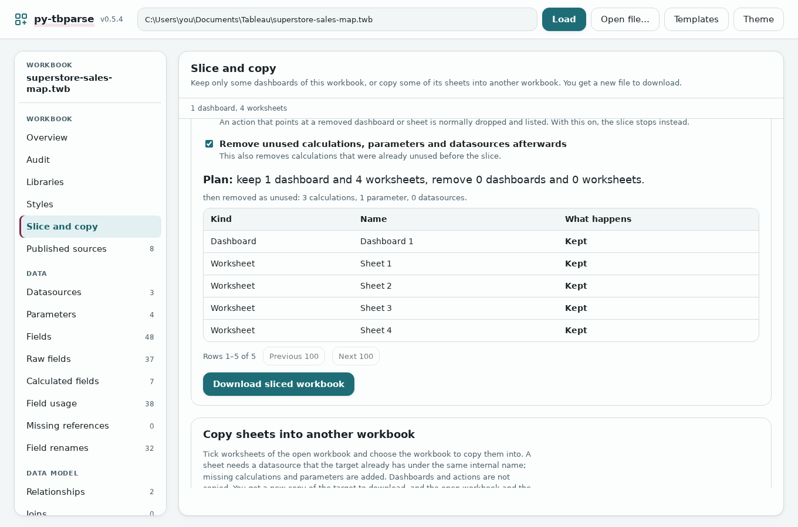

The clean-up also removes calculations that were unused before you sliced; untick the box to keep them.

</details>

<details>
<summary><b>Slice and copy, part 2</b>: copy worksheets into another workbook</summary>

Copy worksheets from the open workbook into a new copy of another workbook. The calculations and parameters they need come along.

**Before you start.** Both workbooks must use the same datasource, under the same name inside Tableau. In practice: workbooks that started from the same file. If the other workbook does not have it, the sheet is **Refused** and the plan says why.

1. Open the workbook you copy **from**, click **Slice and copy**, and go down to **Copy sheets into another workbook**.
2. Press **Choose the target workbook** and pick the workbook to copy **into**. It is not changed; you get a new copy.
3. Tick the worksheets to copy.
4. Choose what happens when a name is already in the target: **Stop** (nothing is made and the clashes are listed), **Rename** (the copy becomes `Sheet 1 (2)`) or **Skip**.
5. Read the plan: each sheet is **Copy**, **Skipped** or **Refused**, then the calculations and parameters it needs (**Already there** or added).
6. Press **Download new workbook** (`<target>_sheetcopy.twb`).

Here the target is a second copy of the example, so every name is taken. With **Stop** the plan says "Stopped: 'Sheet 1' is already a sheet or dashboard of the target" and the download stays off. With **Rename**:

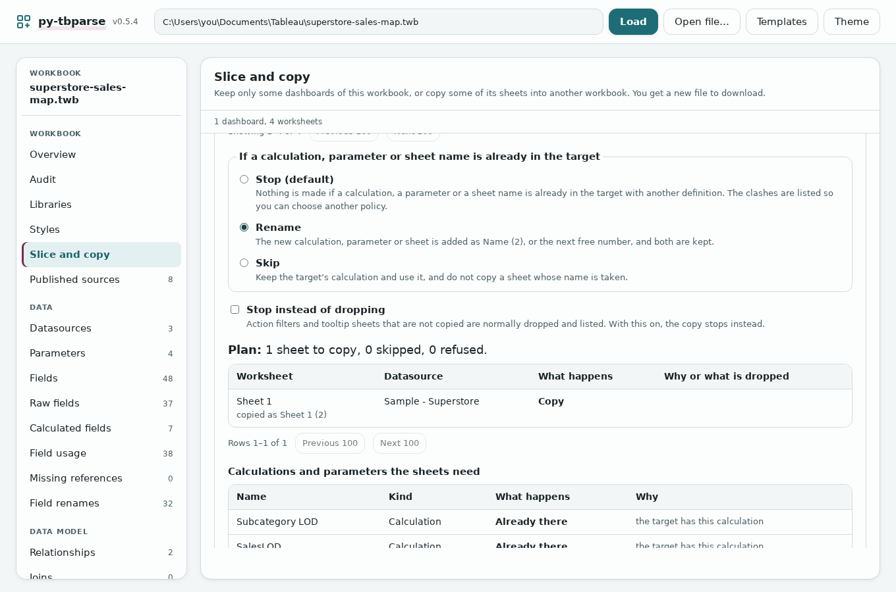

The app copies worksheets, not whole dashboards. It does not copy a sheet that mixes two datasources, and drops action filters (the plan lists them).

</details>

<details>
<summary><b>Templates, part 1</b>: make a template from your workbook</summary>

A template is a finished workbook prepared for reuse: you later fill it with new data and get a new workbook with the same sheets, dashboards and calculations.

1. Open the finished workbook, then press **Templates** at the top. You see three steps for filling a template, and below them **Make a template from your open workbook**.

   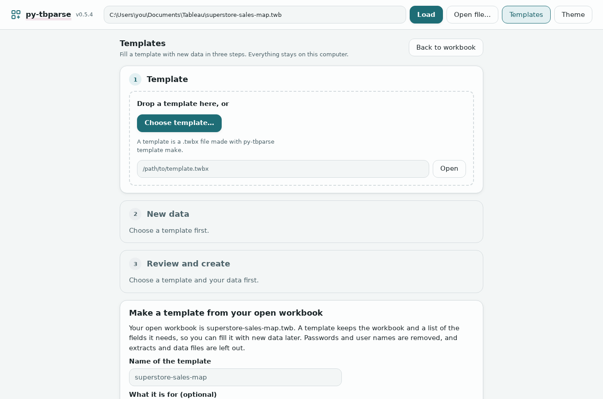

2. In **Make a template from your open workbook**, give it a name and, if you like, a line about what it is for.
3. Press **Make template**. It says how many fields the template needs and shows the **Template check**. Press **Download the template** to keep it (a `.template.twbx` file), or **Use it as the template** to fill it straight away.

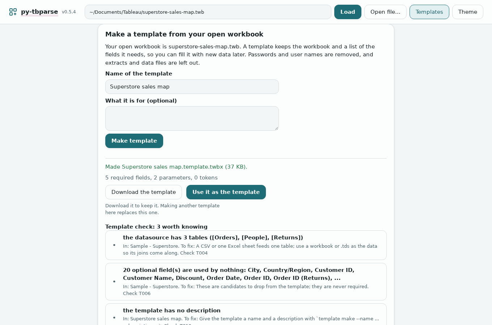

Passwords and user names are taken out, and extracts and data files are left out. Server names and formulas stay as they are, so read the template check before you share a template.

</details>

<details>
<summary><b>Templates, part 2</b>: fill a template with new data</summary>

1. Press **Templates**. In step **1 Template**, press **Choose template...** and pick the `.template.twbx` (or use the one you just made).
2. In step **2 New data**, pick your data: a `.csv`, an Excel file, or a Tableau `.twb`, `.twbx` or `.tds`. For a CSV or Excel file, type the folder where the file will live on your computer, so Tableau finds it later.
3. In step **3 Review and create**, check **Match the fields to your columns**. Each field the template needs gets one of your columns. A **Missing** row needs you to pick a column in its menu.

   For the example, a small CSV with the columns `State`, `Region`, `Category`, `Sub_Category`, `Sales Amount` and `Order Date` matches three fields by name; State/Province and Sales are missing:

   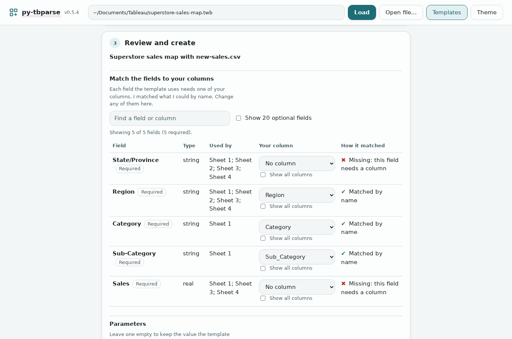

4. Fill in **Parameters** and **Text to fill in** if the template has any. Leave a box empty to keep the template's value.
5. Read **Check before you create**. **Problems to fix** must be empty. After picking `State` and `Sales Amount` it says "Ready to create":

   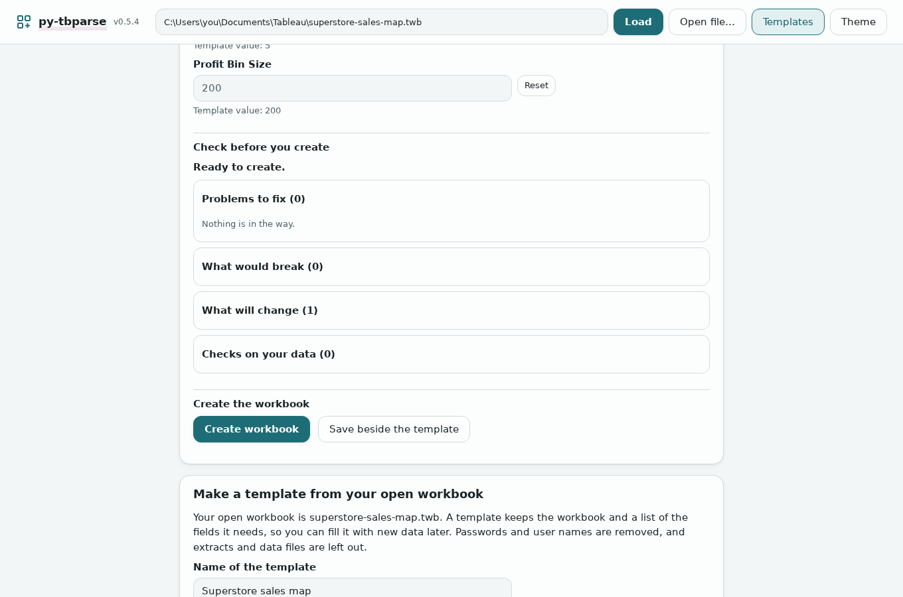

6. Press **Create workbook**. The new workbook downloads. (**Save beside the template** saves it in the template's folder instead; that works when you opened the template by typing its path.)

One CSV file or one Excel sheet fills one table. A template whose datasource joins several tables (like the example, with Orders, People and Returns) says so in the template check; use a workbook or `.tds` as the data so its joins come along. If a required field has no column, **Create** stays off unless you tick **Create anyway**, and then the sheets that use that field stay broken. Never type a password as a parameter value: it would be saved inside the new workbook.

</details>

<details>
<summary><b>Theme and dark mode</b></summary>

Press **Theme** at the top right. Pick one of 34 colour themes, and at the end of the list choose **Auto (follow my system)**, **Light** or **Dark**. The app remembers your choice.

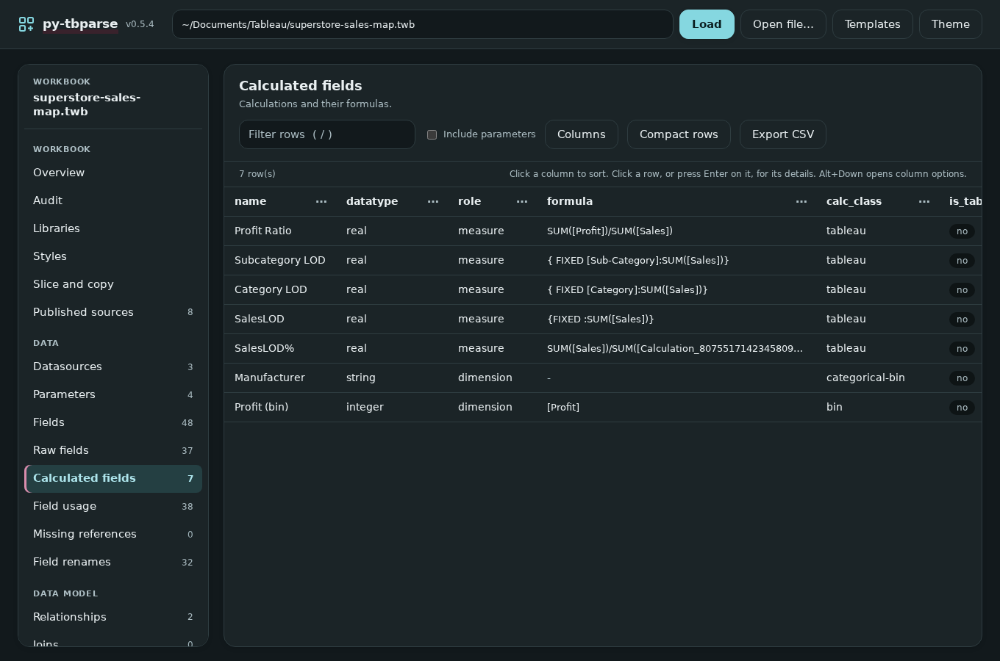

</details>

### Good to know

<details>
<summary><b>Your files and privacy</b></summary>

- **Everything stays on your computer.** The app runs on your own machine at an address only it can reach (`127.0.0.1`). It sends nothing to the internet.
- **Your workbook is never changed.** Every screen makes a new file or a download, and the app never replaces a file that is already there.
- **Look before you download.** Every screen that makes a file shows its plan first.
- **Dropped files** are copied to a private temporary folder (up to 200 MB each) and deleted when you open another workbook or stop the app.
- **The recent list** on the start screen is kept by your browser, on this computer.
- **No login.** Use the app on your own computer, not on a shared network. Sharing it with a team needs a server set up by IT (see [Limits](#limits)).
- **To undo**, delete the new file. Your original is untouched.

</details>

<details>
<summary><b>Not yet checked in Tableau Desktop</b>: read this before you rely on a new file</summary>

The files the app makes are checked against Tableau's published file format and for broken links, on 200 real public workbooks. That is not the same as opening them in Tableau. A template filled with a CSV was opened in Tableau once, for one workbook, and drew its sheets. Nothing else here (renamed copies, sliced copies, copied sheets, added libraries and palettes) has been opened in Tableau Desktop.

So: open every new file in Tableau Desktop and look at each sheet and dashboard before you use or share it. If something looks wrong, keep using your original and tell us at [github.com/DDSNA/py-tbparse/issues](https://github.com/DDSNA/py-tbparse/issues). Details per feature are in [docs/verify-in-tableau.md](https://github.com/DDSNA/py-tbparse/blob/main/docs/verify-in-tableau.md).

</details>

<details>
<summary><b>When something goes wrong</b></summary>

- **`py-tbparse-gui` is "not recognised" or "not found".** Python is not on your computer's PATH. Install Python again with **Add python.exe to PATH** ticked, then install py-tbparse again.
- **The browser does not open.** The terminal shows an address that starts with `http://127.0.0.1:`. Copy it into your browser.
- **The page stopped working.** The terminal window was closed, which stops the app. Start it again.
- **"Check the path, or drop the file onto the page instead."** The path in the box is wrong. Remove the quotation marks, check the spelling, or drag the file onto the page.
- **"that .twbx is damaged or not a zip archive"** or **"there is no workbook (.twb) inside that .twbx"**. The file is not a packaged workbook (it may be a packaged data source). Save it again from Tableau as a workbook.
- **Field renames has Download but no Create.** You dropped or picked the file. Download the copy, or open the workbook by its path to save beside it.
- **The file is larger than 200 MB.** Save a copy without extracts from Tableau and open that.
- **A plan says "Stopped".** A name is already used. Choose **Rename** or **Skip**.
- **A sheet is "Refused".** The plan gives the reason, usually that the other workbook does not have the same datasource.
- **Excel data is refused.** Save old `.xls` and `.xlsb` files as `.xlsx` first.

</details>

<details>
<summary><b>Words used here</b></summary>

- **Workbook**: the file you save from Tableau Desktop. A **`.twb`** holds the sheets and where the data is; a **`.twbx`** (packaged workbook) zips that together with data files and images.
- **Datasource**: a connection to some data (an Excel or CSV file, a database table, a published data source). **Field**: one column of it, such as `Sales`. **Calculated field**: a field made with a formula. **Parameter**: a value the viewer can change.
- **Worksheet** (sheet): one chart or table. **Dashboard**: a page that shows several worksheets together.
- **Path**: where a file is on your computer, such as `C:\Users\you\Documents\Tableau\superstore-sales-map.twb`.
- **Plan**: what a screen would do, shown before you download anything.
- **Clash**: the other workbook already has something with the same name. You choose Stop, Rename or Skip (and for palettes, Replace).
- **Finding**: one thing the audit found, with a rule such as A001.
- **Data dictionary**: a written page describing everything in a workbook.
- **Library**: a small `.library.json` file of calculated fields and parameters. **Palette**: a named list of colours for Tableau's colour picker.
- **Template**: a `.template.twbx` made from a finished workbook, ready to be filled with new data.

</details>

Prefer typing commands or scripting? Everything here, and a few extras that are not in the app (a copy with private details taken out, removing unused calculations, copying whole dashboards), is in the [command-line guide](https://github.com/DDSNA/py-tbparse/blob/main/docs/cli.md).

## For developers and power users

<details>
<summary><b>Everything it does</b> (full feature list)</summary>

- Lists what is in a workbook: datasources, parameters, fields, calculations, joins, relationships, dashboards, custom SQL, published sources.
- Checks relationships and finds calculations that refer to fields the workbook does not have.
- Shows which worksheets, dashboards and calculations use each field.
- Suggests clean names for fields, sheets, dashboards and other objects, and writes a renamed copy.
- Turns a finished workbook into a template you can fill with other data: a CSV, an Excel sheet (`.xlsx`, `.xlsm`), another workbook, or a database table described in a target file. The database is never contacted. Supported: MySQL, PostgreSQL, SQL Server and Snowflake.
- Fills `{{token}}` placeholders in titles, text and captions, so one template gives each customer its own dashboard.
- Makes one workbook per file in a folder (`template apply-folder`), brings a workbook up to a newer template revision (`template update`) and lints a template (`template check`).
- Checks a folder or glob of monthly CSV/Excel files against a template or saved answers (`template drift`): missing, renamed and extra columns, type conflicts, encoding, separator, moved Excel headers, empty files, with fingerprints per file. It does not write a union workbook yet.
- Audits a workbook (`audit`: unused or duplicate calculations, missing references, custom SQL, absolute-path leftovers) and writes a Markdown data dictionary of it (`docs`). Read-only; never opened in Tableau.
- Writes a share-safe copy of a workbook (`sanitize IN OUT --report`): user names, servers, databases, paths, custom SQL, extracts, comments and thumbnails out, a report of what was removed and what it could not judge, optional placeholders and synthetic data. A clean-up, not a guarantee.
- Removes what the audit finds unused (`prune WORKBOOK`: unused calculations and parameters, worksheets on no dashboard only with `--sheets`), only if nothing that stays refers to it. A dry run by default; `--write -o OUT` writes a new file.
- Keeps selected dashboards of a workbook and drops the rest (`slice WORKBOOK --dashboards A,B --write -o OUT`): the other dashboards, the worksheets no kept dashboard uses, their windows, and then the calculations, parameters and datasources only they used. Actions that depend on removed sheets are dropped and reported (`--strict` refuses instead). Not opened in Tableau. Also a Slice and copy view in the GUI.
- Copies worksheets from one workbook into another (`sheet copy SRC --sheets A,B --to TARGET --write -o OUT`): the target needs a datasource with the same connection and the same internal name; the calculations and parameters the sheets need are added, action filters are dropped and listed, and a clash fails unless you pick `--on-clash rename` or `skip`. A dry run by default; the same in the GUI's Slice and copy view, which shows the plan and ends in a download.
- Copies dashboards, with all their sheets, from one workbook into another (`dashboard copy SRC --dashboards A,B --to TARGET --write -o OUT`): the rules of sheet copy, plus the dashboard's own datasources and filter, parameter and legend dependencies, a new dashboard window, and the actions whose source and targets are all copied (the others are dropped and listed). One sheet that cannot be copied refuses its dashboard. A dry run by default.
- Writes the findings of `validate`, `audit` and `template check` as JUnit, SARIF or GitHub annotations for CI (`--format junit|sarif|github`), with a pre-commit hook and a sample workflow.
- Takes calculated fields and parameters out of one workbook into a library file and adds them to another (`library export`, `library import`). The output follows what Tableau writes but has not been opened in Tableau.
- Saves the layout of a dashboard (containers, text, styles, one slot per sheet) as a scaffold and makes a new dashboard from it with your own sheets (`scaffold make`, `show`, `apply`). First slice: a single tiled root only; filters, legends, controls, images and device layouts are dropped and listed. It has not been opened in Tableau.
- Takes named colour palettes out of workbooks and `Preferences.tps` files and writes them into a new `Preferences.tps`, a JSON file or a copy of a workbook (`style show`, `export`, `import`, `check`; also a Styles view in the GUI). Palettes only: it adds them to the colour picker and recolours nothing, and it has not been opened in Tableau.
- Runs as a Docker image behind a TLS proxy. From the next release, the image is also published to the GitHub Container Registry (`ghcr.io/ddsna/py-tbparse`).
- Compares two workbooks, scans a folder of them, and draws the data model as a graph.
- Works from Python, from the command line, or in a local browser page.

</details>

<details>
<summary><b>Install</b> (pip, extras, names)</summary>

```bash
pip install py-tbparse
```

For Excel input to templates, add the optional extra: `pip install "py-tbparse[excel]"` (it installs `openpyxl`).

Python 3.9 or newer. The package, the import and both commands all use the same name: `pip install py-tbparse`, `import py_tbparse`, `py-tbparse`, `py-tbparse-gui`. Releases up to 0.2.0 used `twbparser_py` and `twbparser`; those names are gone.

</details>

<details>
<summary><b>Quick start</b>: Python, command line, browser, across workbooks</summary>

From Python:

```python
from py_tbparse import TwbParser

p = TwbParser("workbook.twb")    # or a .twbx
p.get_overview()                 # counts of everything
p.get_calculated_fields()        # each calculation and its formula
p.get_relationships()            # how the tables connect
```

Every getter returns a DataFrame. The others are `get_datasources`, `get_parameters`, `get_fields`, `get_raw_fields`, `get_joins`, `get_relations`, `get_inferred_relationships`, `get_dashboards`, `get_dashboard_sheets`, `get_custom_sql`, `get_initial_sql`, `get_published_refs` and `get_field_usage`. `get_relationship_graph_dot()` returns the data model as Graphviz text and `validate()` looks for problems in the relationships. In Jupyter, a bare `p` shows the overview.

From the command line:

```bash
py-tbparse workbook.twb                    # overview
py-tbparse workbook.twb calculated-fields
py-tbparse workbook.twb fields --format csv -o fields.csv
py-tbparse workbook.twb validate           # exit code 2 if it finds a problem
```

In the browser:

```bash
py-tbparse-gui workbook.twb
```

Across workbooks:

```python
from py_tbparse import TwbParser, diff_workbooks, scan_folder

diff_workbooks(TwbParser("v1.twb"), TwbParser("v2.twb"), table="datasources")
scan_folder("./workbooks", table="datasources")   # one table, every workbook in the folder
```

</details>

<details>
<summary><b>Guides</b>: every command and feature in detail (docs/)</summary>

- [Command line](https://github.com/DDSNA/py-tbparse/blob/main/docs/cli.md): every table, the `diff`, `batch`, `rename`, `template`, `library`, `style` and `scaffold` commands, and their options.
- [Browser GUI](https://github.com/DDSNA/py-tbparse/blob/main/docs/gui.md): opening files, the table, the overview, the audit, the graph, themes, filling a template with new data, and making a template from the open workbook (Templates).
- [Running as a server](https://github.com/DDSNA/py-tbparse/blob/main/docs/deployment.md): the Docker image, a reverse proxy that ends TLS, sessions, limits.
- [Renaming](https://github.com/DDSNA/py-tbparse/blob/main/docs/renaming.md): clean names after a datasource switch, editing the suggestions, what will stay broken.
- [Templates](https://github.com/DDSNA/py-tbparse/blob/main/docs/templates.md): make a template from a workbook and apply it to new data.
- [Sanitize](https://github.com/DDSNA/py-tbparse/blob/main/docs/sanitize.md): the share-safe copy, its categories, the report and the optional synthetic data.
- [CI output and pre-commit](https://github.com/DDSNA/py-tbparse/blob/main/docs/ci.md): `--format junit|sarif|github`, exit codes, rule ids, sample workflow.
- [Prune](https://github.com/DDSNA/py-tbparse/blob/main/docs/prune.md): what it removes, what keeps a field, the report, the limits.
- [Slice](https://github.com/DDSNA/py-tbparse/blob/main/docs/slice.md): keep selected dashboards, what is dropped, actions, errors, the limits.
- [Audit and data dictionary](https://github.com/DDSNA/py-tbparse/blob/main/docs/audit.md): the audit rules A001 to A011, what "used" means, the Markdown data dictionary.
- [Libraries](https://github.com/DDSNA/py-tbparse/blob/main/docs/libraries.md): export calculated fields and parameters, add them to another workbook, what is not covered; also a Libraries view in the GUI.
- [Dashboard scaffolds](https://github.com/DDSNA/py-tbparse/blob/main/docs/scaffolds.md): make a dashboard layout from another one, what is kept and dropped, the integrity check, and what was not checked in Tableau.
- [Sheet copy](https://github.com/DDSNA/py-tbparse/blob/main/docs/sheet-copy.md): copy worksheets between workbooks, what is added and dropped, the clash policies, and what was not checked in Tableau. The library pieces under it are in [Sheet copy core](https://github.com/DDSNA/py-tbparse/blob/main/docs/sheet-copy-core.md).
- [Dashboard copy](https://github.com/DDSNA/py-tbparse/blob/main/docs/dashboard-copy.md): copy dashboards with their sheets between workbooks, what comes along, the clash policies, and what was not checked in Tableau.
- [Colour palettes](https://github.com/DDSNA/py-tbparse/blob/main/docs/styles.md): list, export and import named palettes, the clash policy, why nothing is recoloured and what was not checked in Tableau.
- [Normalised XML diff](https://github.com/DDSNA/py-tbparse/blob/main/docs/diff-xml.md): `py-tbparse diff-xml A B` and `normalised_diff()`, a line diff of two workbooks' XML that ignores attribute order, quotes and indentation.
- [`.twbx` files](https://github.com/DDSNA/py-tbparse/blob/main/docs/twbx.md): they are read straight from the zip; how to extract the contents.
- [Development](https://github.com/DDSNA/py-tbparse/blob/main/docs/development.md): running the tests, the workbook corpus, the browser tests.

</details>

<details>
<summary><b>Development, CI and deployment</b></summary>

- Running the tests, the 200-workbook corpus and the browser tests: [docs/development.md](https://github.com/DDSNA/py-tbparse/blob/main/docs/development.md).
- The code layout, the module table and the rules for porting a function from the R package: [AGENTS.md](https://github.com/DDSNA/py-tbparse/blob/main/AGENTS.md).
- CI output formats and the pre-commit hook: [docs/ci.md](https://github.com/DDSNA/py-tbparse/blob/main/docs/ci.md).
- The Docker image and running the GUI behind a TLS proxy: [docs/deployment.md](https://github.com/DDSNA/py-tbparse/blob/main/docs/deployment.md).
- The screenshots: `scripts/readme_screenshots.py` takes the pictures at the top of this page and in docs/gui.md (from the made-up demo workbook); `scripts/guide_screenshots.py` takes the user's guide pictures (`docs/guide-*.png`) from the public Superstore workbook in the corpus (`scripts/fetch_corpus.py` fetches it); `scripts/gui_screenshots.py WORKBOOK OUT_DIR` captures every view (also Audit, Libraries, Styles and Slice and copy in light, dark and phone width) for comparing before and after a GUI change, and is retaken at each major release.

</details>

<details>
<summary><b>Why a Tableau parser</b></summary>

A `.twb` is XML and a `.twbx` is a zip containing one, so reading them from Python is not hard. Power BI's `.pbix` is a binary format built on a proprietary storage engine, and getting into it from code took reverse-engineering projects like [PBIXRay](https://github.com/Hugoberry/pbixray) and [pbi-tools](https://github.com/pbi-tools/pbi-tools). On the server side it goes the other way: Tableau's own Python tooling ([tableauserverclient](https://pypi.org/project/tableauserverclient/) and `tabcmd`) is more mature and more open than what Microsoft has for the Power BI REST API.

</details>

## Limits

- **Little of what the tool writes has been opened in Tableau.** Everything it writes is checked against Tableau's published schema and for dangling references, on 200 real workbooks. A template applied to a CSV and to a workbook has been opened in Tableau once, for one workbook, and drew its sheets (see [verify-in-tableau.md](https://github.com/DDSNA/py-tbparse/blob/main/docs/verify-in-tableau.md)); renamed workbooks, workbooks with a library added, palettes imported and other shapes have not. Open one on a copy and check it before relying on it. The original file is never modified or overwritten.
- **Only part of the R package is ported.** Missing: formatting, tooltips, colors, axes and sorts, dashboard layout and actions, calculation complexity, the replication brief and the Shiny inspector. The GUI covers some of what the inspector did.
- Where the R version has a bug, this one does not copy it: joins and relationships on more than one key, nested joins, the include-parameters option, and calculations with brackets inside brackets.
- **No login.** The GUI is meant to run on your own machine for one person. It refuses requests that come from other websites, but there is no login, so do not put it on a shared network. To share it, use the [Docker image](https://github.com/DDSNA/py-tbparse/blob/main/docs/deployment.md) behind a proxy that adds TLS and a login.

## Contributing

Issues and pull requests are welcome at [github.com/DDSNA/py-tbparse](https://github.com/DDSNA/py-tbparse). The test setup is in the [development guide](https://github.com/DDSNA/py-tbparse/blob/main/docs/development.md). `AGENTS.md` describes the code layout and the rules for porting a function from the R package.

## Credit

Based on [twbparser](https://github.com/PrigasG/twbparser) by George Arthur, MIT licensed. The user's guide pictures use `Brushing_Superstore_Sales_Map.twb` from [1230harry/TeamOne_MSc_Group_Project](https://github.com/1230harry/TeamOne_MSc_Group_Project) (MIT).

## License

MIT, see [LICENSE](https://github.com/DDSNA/py-tbparse/blob/main/LICENSE).
