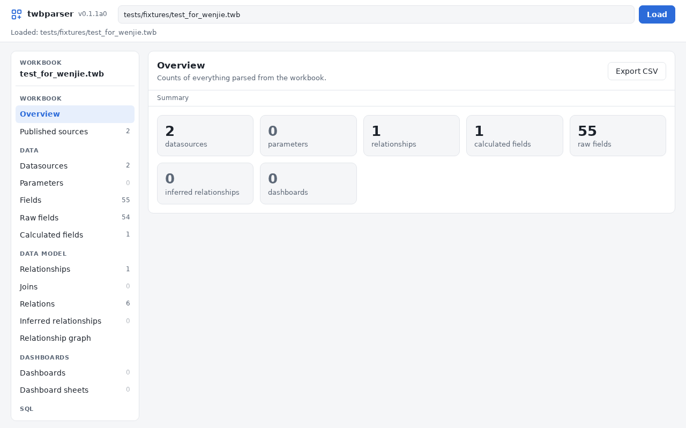

# py-tbparse

Open a Tableau workbook and see what's inside it, without opening Tableau.

py-tbparse reads `.twb` and `.twbx` files and hands you back pandas
DataFrames: the datasources, fields, calculated fields, joins,
relationships, dashboards, custom SQL and more. It's plain Python (`lxml`
and `pandas`), so there's no R to install and no Tableau license needed.

It's a port of George Arthur's R package
[`twbparser`](https://github.com/PrigasG/twbparser), and it adds a few
things of its own: a small browser GUI, a command-line tool, a way to
diff two workbooks, and a way to scan a whole folder of them.



## Getting started

Grab the code and install it:

```bash
git clone https://github.com/DDSNA/py-tbparse.git
cd py-tbparse
pip install -e .
```

A quick note on names, since they differ: the project is called
**py-tbparse**, but you import it as `twbparser_py`, and the commands are
`twbparser` and `twbparser-gui`.

Then, from Python:

```python
from twbparser_py import TwbParser

p = TwbParser("workbook.twb")   # .twbx works too
p.get_overview()                # a quick summary of what's in there
p.get_calculated_fields()       # every calculation, with its formula
p.get_relationships()           # how the tables connect
```

Each `get_...` method returns a DataFrame. Here's the full list:

| Method | What you get |
|---|---|
| `get_overview()` | Counts of everything below |
| `get_datasources()` | Connections and their primary tables |
| `get_fields()` | Every column, across all datasources |
| `get_calculated_fields()` | Calculations and their formulas |
| `get_joins()` | Joins from the physical layer |
| `get_relationships()` | Relationships from the logical layer (Tableau 2020.2+) |
| `get_inferred_relationships()` | Links guessed from matching field names |
| `get_dashboards()` / `get_dashboard_sheets()` | Dashboards and the sheets on them |
| `get_custom_sql()` / `get_initial_sql()` | SQL embedded in the workbook |
| `get_published_refs()` | References to published datasources |
| `get_relationship_graph_dot()` | The data model as a Graphviz DOT string |
| `validate()` | Checks your relationships for problems |

A handful more (`get_parameters()`, `get_raw_fields()`, `get_relations()`)
are there when you need them. In a Jupyter notebook, just putting `p` on
its own line shows the overview.

### Comparing and scanning

```python
from twbparser_py import diff_workbooks, scan_folder

# What changed between two versions of a workbook?
diff_workbooks(TwbParser("v1.twb"), TwbParser("v2.twb"), table="datasources")

# One table, across every workbook in a folder
scan_folder("./workbooks", table="datasources")
```

### A note on `.twbx` files

A `.twbx` is a zip file with the workbook inside. py-tbparse reads it
straight from the zip and never writes anything to disk, so nothing gets
left behind in your temp folder. The catch: for a `.twbx`, `p.twbx_dir` is
`None`, and `p.path` is a made-up `<file>.twbx/<name>.twb` path that you
can't open. If you do want the files on disk, ask for them:

```python
from twbparser_py import extract_twb_from_twbx, twbx_extract_files

extract_twb_from_twbx("workbook.twbx", extract_dir="out/")
twbx_extract_files("workbook.twbx", exdir="out/")   # everything in the package
```

## From the command line

```bash
twbparser workbook.twb                        # the overview
twbparser workbook.twb tables                 # what tables are available?
twbparser workbook.twb calculated-fields      # print one
twbparser workbook.twb fields --format csv -o fields.csv
twbparser workbook.twbx dashboard-sheets --dashboard "Sales Overview"
twbparser workbook.twb validate               # exits with 2 if something's off
twbparser workbook.twb graph > model.dot      # add --include-inferred for guesses
twbparser diff old.twb new.twb datasources    # what was added or removed
twbparser batch ./workbooks datasources       # one table, every workbook in a folder
```

The tables you can ask for are `overview`, `datasources`, `parameters`,
`fields`, `raw-fields`, `calculated-fields`, `joins`, `relations`,
`relationships`, `inferred-relationships`, `dashboards`,
`dashboard-sheets`, `custom-sql`, `initial-sql` and `published-refs`.

`--format` can be `table` (the default), `csv` or `json`. The `graph`
command always prints Graphviz text, whatever you pass. `diff` and `batch`
take the same table names, except `graph`, `validate` and `tables`.

## The GUI

If you'd rather click around, there's a small browser app. It only needs
the standard library, so there's nothing extra to install:

```bash
twbparser-gui workbook.twb              # opens your browser with the workbook loaded
twbparser-gui                           # starts empty: paste a path and press Load
twbparser-gui --no-browser --port 8765  # just run the server (handy on a headless box)
```

Once a workbook is loaded, the sidebar lists every table with its row
count, so you can see at a glance what's worth opening. Click a column
header to sort, type in the box to filter (press `/` to jump to it), and
click a row to see long values like formulas and SQL in full. The overview
tiles are links, too. There's a light and a dark theme, and it adapts to a
narrow window.

On the graph view you can copy or download the DOT text, with or without
the inferred relationships, and any other table exports as CSV.

It's a single-user tool meant for your own machine. It rejects requests
that come from other websites, but it has no login, so please don't
expose it on a shared network.

## Running the tests

```bash
pip install -e ".[test]"
pytest
```

The sample workbooks in `tests/fixtures/` are the same small ones the R
package tests with.

The GUI also has end-to-end tests that drive the page in a real headless
Chromium through Playwright, and fail on any JavaScript error. They skip
themselves if the browser isn't installed, so the rest of the suite runs
fine without it. To turn them on:

```bash
pip install -e ".[test,browser]"
playwright install chromium        # add --with-deps if you have root
./scripts/setup-browser-libs.sh    # no root? this unpacks the system libraries locally
pytest tests/test_gui_browser.py
```

## How it relates to the R package

The goal is to behave like the R original, so the code follows it
closely, function for function. This is a first pass, though, and it
doesn't cover everything yet. Still missing: formatting, tooltips,
colors, axes and sorts, dashboard layout and actions, the analytics
helpers (calculation complexity, field usage, replication brief), and the
Shiny inspector. The GUI loosely fills that last role.

In a few places this port deliberately behaves better than the original,
because the R version has bugs that weren't worth copying: joins and
relationships on more than one key, nested joins, the option to include
parameters, and calculations with brackets inside brackets.

## Why this exists

A `.twb` is just XML, and a `.twbx` is a zip around one, so reading
them from Python is pretty approachable. Power BI's `.pbix` is a
different story: it's a binary container built on a proprietary storage
engine, and getting at it from code took dedicated reverse-engineering
projects like [PBIXRay](https://github.com/Hugoberry/pbixray) and
[pbi-tools](https://github.com/pbi-tools/pbi-tools).

It's not all one-way, though. For automating a *server*, Tableau's own
Python tooling
([`tableauserverclient`](https://pypi.org/project/tableauserverclient/)
and `tabcmd`) is more mature and more open than anything Microsoft offers
for Power BI's REST API.

## Credit

This is a port of the R package
[`twbparser`](https://github.com/PrigasG/twbparser) by George Arthur,
which is MIT licensed. Thanks to George for the original work this is
built on.
