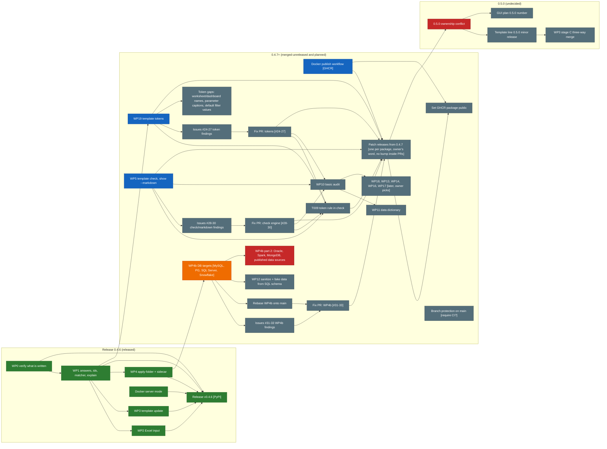

# py-tbparse: where things stand and what to do next

> **Read `docs/template-next-plan.md` first** (2026-10-04): the decided, ordered and detailed plan for what to build
> next (connection targets, tokens, template check, sanitize, basic audit and docs), the owner's decisions, versioning,
> and the questions still open. This file keeps the history of WP0 to WP4 and the known gaps; its section 3 ("Next work
> packages") is superseded by that plan.

Written 2026-10-02 for the next agent; state refreshed 2026-10-04 after #20, #22 and #23 merged. Verify against the
repo before relying on anything: `git log`, `gh pr list -R DDSNA/py-tbparse`, `gh issue list -R DDSNA/py-tbparse`,
`git ls-remote --heads origin`. How to work with the owner and in this sandbox: `CLAUDE.md` (local, not tracked; if it
is missing, the rules are: commit as DDSNA with no Claude attribution, never push / PR / merge / release unasked, work
in a fresh worktree off `origin/main`, one PR per package, no version bump inside a PR, a patch release per package
from 0.4.7 only on the owner's word). Architecture and testing conventions: `AGENTS.md`. The long plan with research
and all work packages (WP0 to WP19): `docs/template-roadmap-plan.md` (brought over from the branch
`docs/template-roadmap`, with a status note on top).

## 1. State

| What | Where | State |
|---|---|---|
| `main` | origin | `4a3cfff`, `pyproject.toml` says **0.4.6**. Released: **v0.4.6** (tag on `5cf3c7b`, PyPI) with #17 (Docker server mode), #19 (WP0, WP1) and #18 (WP2, WP3, WP4 core, the Custom SQL validator fix). **Merged after the release, unreleased**: #20 (WP19 tokens), #22 (Docker publish workflow), #23 (WP5 `template check`, `show --markdown`). |
| Docker publish | `.github/workflows/docker-publish.yml` | on `main` (#22), **never run** (no release since); pushes to GHCR when a GitHub Release is published, gated on the `release` environment; its header still says DRAFT. After the first push the owner sets the package public. |
| WP4b part 1: database targets | branch `wp4b-targets` | **PR #21 (draft)**, conflicts with `main`: needs a rebase. |
| Review findings | issues | unfixed: **#24 to #27** tokens, **#28 to #30** check engine and `show --markdown`, **#31 to #33** WP4b (#33 is labelled documentation). |
| The long plan | `docs/template-roadmap-plan.md` | brought over from the branch `docs/template-roadmap` (that branch can go once this lands). |
| Merged and deleted | `worktree-docker-server`, `worktree-wp0-verification`, `wp1-answers-matcher` | merged through #17 and #19; branches and worktrees removed 2026-10-04. |
| Merged, branch still on origin | `wp3-template-update`, `wp19-tokens`, `docker-publish`, `wp5-check` | merged through #18, #20, #22, #23; deleting them is the owner's call. |

Green released, blue merged and unreleased, orange open PR, grey planned, red blocked or undecided. Arrows go from a
prerequisite to what depends on it. WP12, WP4b part 2, the later packages and the 0.5.0 nodes are from the plans, not
from the repo. Part 2 of WP4b is "blocked" because no sample workbooks will come: a class without corpus evidence is
refused without `--experimental`, or the package is skipped.

Tests on the WP1 branch (before it merged): 449 non-browser tests pass (about 3.5 minutes, corpus included). **The browser (GUI)
suites were not run on those branches** (no page code changed, but `main` has since changed `webgui.py` and the page).

What was built, in one paragraph each:

- **WP0** (`py_tbparse/verify.py`, `tests/schema_check.py`, `tests/test_schema.py`, `tests/test_verify.py`,
  `scripts/make_verification_pack.py`, `docs/verify-in-tableau.md`): everything that writes a workbook is checked
  against Tableau's published XSD (vendored in `tests/schemas/`, Apache-2.0) and by `validate_workbook()` for
  dangling references. Both are differential (only what the output has and the input did not), because real
  workbooks mostly fail the 2026.2 schema already. The owner opened the pack in Tableau: the CSV-backed and
  workbook-backed outputs drew their sheets.
- **WP1** (`py_tbparse/templates.py`, `cli.py`, `tests/test_templates_v2.py`, `test_matcher.py`, `test_explain.py`):
  manifest version 2 (template `id`, `revision`, a `uid` per field), answers version 2 (per-datasource entries,
  `profiles`, a schema fingerprint; never credentials), `apply_template(answers=, profile=)` through
  `resolve_apply()` / `ApplyPlan`, matcher improvements (alias, deterministic ties, `role differs`), `check_data()`,
  `explain()`, and `broken_sheets()` naming dashboards, calculations and filters. CLI: `--answers`, `--profile`,
  `--explain`, `--check`, `--deep`. Documented in `docs/templates.md`.

### Done since (merged: WP2 to WP4 through #18, released in 0.4.6; WP19 and WP5 through #20 and #23, unreleased)

- **WP3 stages A and B** (`py_tbparse/template_update.py`, `tests/test_template_update.py`, CLI `template update`,
  `make_template(revision_of=)`): the report (`template_update_report`, `diff_template_revisions`) and the re-apply
  (`update_from_answers`) as designed in section 3 below, with these decisions: apply now keeps a manifest snapshot
  (`answers["template"]["manifest"]`) and `data.columns` in the answers, so the "before" needs no old template file
  (`--old` for answers made before that); a renamed field (same source column or caption, new local name) carries its
  saved column; a saved parameter value the template no longer accepts is dropped and reported rather than stopping;
  a new required field or a saved column of the wrong type stops it unless `--allow-missing` / `--mapping`; a workbook
  made from several datasources is refused (re-applying one would drop the others' connections). Stage C is not started.
- **WP2 Excel** (`read_data(sheet=)`, `_excel_connection`, `tests/test_excel.py`, `--sheet`, extra `py-tbparse[excel]`,
  `openpyxl` in `[test]`): the connection shape and remote types were measured from the 88 `excel-direct` corpus
  workbooks (string 130, integer 20, real 5, date and datetime 7, boolean 11; `gridOrigin`, `[Sheet$]`). `.xls`/`.xlsb`
  are refused (assumed decision, still the owner's). The verification pack has `4-template-on-excel.twbx`: **not yet
  opened in Tableau**, that is the owner's check. `_csv_connection` and `_excel_connection` now share `_file_connection`
  (the CSV output is byte-identical to before). Not done: `check_data` reads values only from CSV; a template over several
  tables is still unproven for Excel as for CSV.
- **WP4 batch apply** (`py_tbparse/template_batch.py`, `tests/test_template_batch.py`, CLI `template apply-folder`): one
  workbook per file, `summary.csv`, sidecar CSV for per-file parameters and sheet, tolerance gate (`--min-mapped`),
  `--on-error`, `--workers`. Owner confirmed the folder-of-customers use case (2026-10-04). Connection targets (live DBs,
  published data sources: standard DBMS + Spark, Mongo if feasible, standard connectors, no credentials) are WP4b:
  part 1 is PR #21 (draft, needs a rebase), part 2 has no samples and will not get any (section 2).
- **WP19 template tokens** (package C, merged as #20): `py_tbparse/tokens.py`, `{{name}}` in titles, text objects, field
  and datasource captions and string parameter values; `--token` on `make`, `apply`, `apply-folder` and `update`; sidecar
  columns. **Not covered**: worksheet and dashboard names, parameter captions, default filter values (an open scope
  question for the owner). Review findings #24 to #27 are open.
- **Docker publish workflow** (#22): see the state table; never run.
- **WP5 template check and `show --markdown`** (package D, merged as #23, `4a3cfff`: `py_tbparse/findings.py`,
  `template_check.py`, `docgen.py`, `tests/test_findings.py`, `test_template_check.py`, `test_docgen.py`, a corpus test in
  `test_corpus.py`): the shared findings engine (stable rule ids, sorted deterministic frame, `table|csv|json` through a
  registry, a crashing rule becomes an `error` finding), template rules T001 to T008 and T010, `template check
  [--format --fail-on --only --skip]` (exit 1 on a finding at `--fail-on`, 2 on a usage or read error) and `template show
  --markdown [-o FILE]`. **T009 (the token rule) is planned next, not built yet**: tokens are merged now, but the id stays
  reserved in `template_check.py` until the PR that adds the rule (one function, see `AGENTS.md`). Review findings #28 to
  #30 are open. Not opened in Tableau: it writes no workbook.
- Tests: whole non-browser suite (519 passed, 155 skipped after WP4, per that session's note). The PR bodies of #20 and #23
  report 560 passed, 1 failed (fixed) and 591 passed, 1 failed (`test_version.py`, the stale editable install), both
  before their rebases; the whole suite has not been re-run on `main` since. The browser suites were not run (no page
  code changed).

## 2. Do first

1. **Fix the review findings, one fix PR each, off `main`, in the owner's order**: tokens (#24 to #27, from #20), then
   the check engine and `show --markdown` (#28 to #30, from #23), then rebase PR #21 (WP4b part 1) onto `main` and fix
   #31 to #33. Before each PR run the whole non-browser suite; run the browser suites
   (`./scripts/setup-browser-libs.sh` once; `pytest -q tests/test_gui_*.py`, one Chromium at a time) when page code or
   `webgui.py` changed. Squash-merge is what the owner uses.
2. **Then the next packages**: WP10 basic audit and WP11 data dictionary (package F of `docs/template-next-plan.md`),
   and the T009 token rule in `template check`. WP4b part 2 gets no sample workbooks: a class without corpus evidence
   stays refused without `--experimental`, or is skipped.
3. **Version.** A **patch release per package from 0.4.7**; **no version bump inside a PR**; a release only on the
   owner's explicit word. Whether the template line still gets a 0.5.0 minor is an open owner question (section 4).
   Release notes follow `/home/claude-user/ai-sandbox/release-0.4.5.md`; the pre-release and wheel smoke-test checklist
   is in `release-plan-0.4.5.md` and `AGENTS.md`. The first release after #22 is also the first run of the Docker
   publish workflow.
4. **More Tableau checks (the owner does them; you prepare the files).** Re-run
   `python scripts/make_verification_pack.py <new folder>` on the merged code, and extend it for what is still
   unchecked: a workbook that writes the object model in the plain form (corpus example
   `AlexAlkhatib__alex-the-analyst__Classeur.twb`), a template over several tables, and file 1 (renamed) with its
   data reachable so the new captions can be seen. Record results in the Status section of
   `docs/verify-in-tableau.md`. The first run found a real bug the tests missed: expect that to happen again.
5. **Backlog hygiene** (only if asked): the JSON and GitHub Project 6 did not list WP0, WP1, WP5 or the
   "connection targets" stretch when this was first written (not re-checked). See `CLAUDE.md`.

## 3. Next work packages

History: WP3 (stages A and B) and WP2 below were built and merged through #18 (released in 0.4.6); the current plan
is `docs/template-next-plan.md`.

Order the owner approved in principle: WP3 stages A and B, then WP2. Both depend only on WP1. Everything below is
my design; the plan has more detail. Each package is one branch and one PR, test-first, with a corpus smoke test,
docs and CLI help, and no version bump until a merge is planned.

### WP3: `template update` from saved answers (stages A and B)

Goal: the author improves a template; a user re-applies it to the same data and mapping and learns what changed.
Stage C (three-way merge) is **not** to be started: it needs a design note and the owner's go.

1. `make_template(..., revision_of=OLD)`: keep the old template's `id`, set `revision = old + 1` (today
   `make_template` accepts `template_id` but always writes revision 1).
2. **Stage A, report only**: `diff_template_revisions(old_manifest, new_manifest) -> DataFrame` (fields added /
   removed / renamed by `uid`, falling back to name; `required` flag changes; type changes; parameters added,
   removed, default or allowed values changed; sheets and dashboards added or removed). Then classify each against
   the saved mapping: `auto-carry`, `needs-mapping` (new required field), `orphaned` (mapping targets a removed
   field), `type-conflict`. CLI: `template update NEW_TEMPLATE WORKBOOK` prints it and writes nothing.
3. **Stage B, re-apply**: `update_from_answers(template, workbook, output_path=None, overwrite=False, report=None)`
   = `resolve_apply(new, answers=workbook)` plus `apply_template`. Stop and list `needs-mapping` rows unless
   `--allow-missing`. Use the data's fingerprint (WP1) to say which columns appeared or vanished and re-suggest only
   those.
4. Guards: same `manifest_sha256` in the answers = no-op, say so; different template `id` = refuse (already done in
   `resolve_apply`); answers from a version 1 template (no `id`) = allowed, say it cannot be checked.
5. Tests: add a field, remove a field, rename a caption (uid unchanged), change a parameter default, change a type,
   moved data file, answers from another template, a snapshot of the stage A table. Corpus: for every workbook make
   revision 2 identical to 1 and expect an empty report.

### WP2: Excel input (`.xlsx`, `.xlsm`)

1. `openpyxl` as an optional extra (`excel = ["openpyxl>=3.1"]`) and in the `test` extra; import lazily and raise
   `TemplateError("install py-tbparse[excel]")`. Legacy `.xls`: refuse with a clear message (owner decision pending,
   assumed no). It is not installed in the shared venv yet.
2. `read_data(path, datasource=None, sheet=None)`: sheet by name or index; several visible sheets and none chosen =
   fail listing them; hidden sheets ignored unless named; first non-empty row is the header; duplicate headers get a
   suffix and a warning; read 2000 rows for type inference with the existing `_infer_csv_type`. `DataSource` gets
   `sheet`; answers record it (`data.sheet`); CLI `--sheet`.
3. **Connection writer** `_excel_connection(data, local_of, model, object_id)` beside `_csv_connection`, same two
   object-model dialects (`_object_model()`), same rules (keep the template's object id, table column after
   `<aliases>`). **Copy what Tableau writes**: 88 corpus workbooks use `excel-direct`
   (`grep -l excel-direct tests/corpus/files/*`). Check the relation name (`[Sheet$]`), the `cols`/`map` shape, the
   remote-type codes for Excel (they differ from text files: measure them from the corpus, as was done for CSV),
   and whether an Excel datasource keeps its `<named-connection>` the same way.
4. Tests: small workbooks built with openpyxl in `tmp_path`; multi-sheet error; header offset; duplicate headers;
   dates; missing extra gives the install hint; the differential schema and reference checks from `tests/test_schema.py`
   on an Excel-backed output; extend `make_verification_pack.py` with an Excel-backed file for the owner.

### After that

Plan section 4b.4 suggests: WP19 template tokens (with WP1 answers and WP4 batch), WP12 sanitize, WP10 audit and
prune, WP18 CI output formats, then WP13, WP14, WP17, WP16; park WP15 (downgrade writer), Power BI conversion and
publishing. WP4 (batch apply) and WP5 (template check) are small and high value. WP9 (GUI Templates view) waits for
the owner and for Tableau results.

## 4. Questions for the owner (do not decide them)

Answered since: landing (one PR per package), `.xls` (refused unless small), sample workbooks (none will come),
batch and connection targets (wanted), fake data (only from an SQL-type schema), audit (basic), versions (patch per
package from 0.4.7, no bump inside PRs, release on his word). Still open:

- **0.5.0**: the docs said the template line is the 0.5.0 minor, the owner then chose a patch per package; the GUI plan
  mentions 0.5.0 and 0.6.0 only in `docs/ui-redesign-plan.md`. Who, if anyone, takes 0.5.0.
- Token scope: worksheet and dashboard names, parameter captions, default filter values are not token places yet.
- Branch protection: `main` has none (checked 2026-10-04); require CI before merge or not.
- Squash merges in the web UI make commits authored "Dan", not DDSNA; whether that matters.
- Three-way merge (WP3 stage C); `.tps` palettes first or the whole style template; WP18 or `prune` after the basic
  audit.
- Delete the merged branches still on origin (section 1); `worktree-docker-server` is already gone. The shared venv
  and main checkout need an update (`git pull --ff-only` there, then `.venv/bin/pip install -e .`); that is theirs to do or to allow.

## 5. Known gaps and things I would check

- **Templates over several tables**: a CSV feeds one table. `_csv_connection` writes one object and one table
  column; sheets that count another table's rows (`[__tableau_internal_object_id__].[cnt:...]`) would point at
  nothing. The corpus differential test passes, but it only applies the first datasource with fields and excuses
  fields the CSV cannot feed, so this is not proven either way. Look at multi-object workbooks (corpus files with
  `relation:collection` or `relation:join`) before relying on it.
- Fixed in the WP1 review: `field_usage` did not tie a set to its field when the set names the field by a derived
  name (`[none:Region:nk]`, 31% of group references in the corpus), so a sheet that used only the set did not make
  the field `required`. `usage._base_field` now resolves it. Other derived forms (table calculations such as
  `[pcdf:sum:Sales:qk]`) are not resolved.
- `explain` does not list parameters (none in the corpus depends on a field; there are no parameter actions either);
  `check_data` reads values only for a CSV and its key heuristic is a guess at names (`*_id`, `*_key`, `*_code`).
- `role differs` can only fire when the new data is a workbook or `.tds` (a CSV has no roles).
- Profiles must be written into the answers file by hand; there is no `template profile` command and no command that
  extracts a standalone `*.answers.json` from a workbook (the Python `read_answers` does).
- `verify.py`'s `calc-reference` findings are warnings because a bracketed word inside a string counts as a
  reference; the corpus has 14 such findings in its original workbooks already.
- The schema is 2026.2 only; most corpus workbooks are 18.1. The differential approach hides that, but a real
  `<ManifestByVersion/>` / version alignment (see `tests/schemas/UPSTREAM-README.md`) is untested.
- `tests/test_version.py` fails in this sandbox on a branch whose version differs from the owner's checkout (the
  shared venv's editable install); not a branch bug.
- **Tokens** do not cover worksheet and dashboard names, parameter captions or default filter values (owner question);
  the T009 token rule in `template check` is planned next, not built yet.
- **Windows server race, still open**: CI run 37229010116 on `main` (`4a3cfff`) failed on attempt 1 in
  `tests/test_webgui.py::test_load_requires_json_content_type[text/plain]` (Windows, Python 3.12) and passed on the
  re-run. Per a read-only review, `webgui._do_post` answers 404/415/403 without draining the request body
  (`_drain` exists but is not used on those paths); fix pending.

## 6. Starting a package (checklist)

1. Read `AGENTS.md`, `CLAUDE.md` if present, this file, and the plan section for the package.
2. `EnterWorktree` (fresh, off `origin/main`) or, for a stacked package, `git worktree add -b NAME PATH BRANCH` and
   `EnterWorktree` with `path`. Fetch the corpus: `python3 scripts/fetch_corpus.py`.
3. Baseline: `PYTHONPATH=. /home/claude-user/ai-sandbox/py-tbparse/.venv/bin/python -m pytest -q` for the files you
   will touch. Write the failing test first.
4. Build; run the corpus tests; run the differential checks if you write XML; update docs, CLI help, `AGENTS.md`.
5. Commit as `DDSNA` (no attribution; see `AGENTS.md`), check authors, and stop: push, PR and merge only when told.
